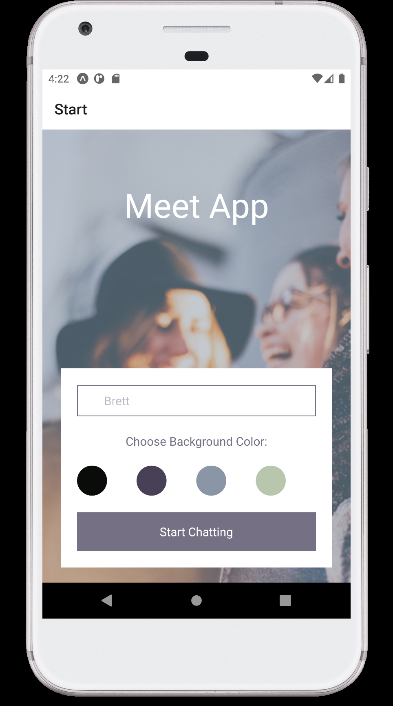
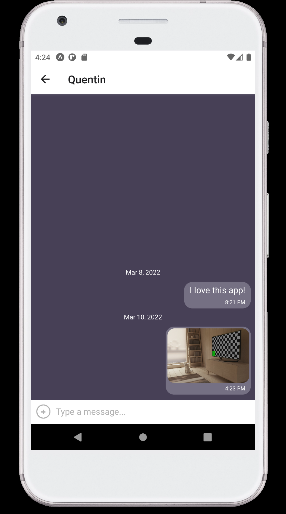

# Chat-App

A Chat app for mobile devices, built using React Native. The app will is built to provide users with a chat interface and options to share images and their location.

# Key Features

- A page where users can enter their name and choose a background color for the chat screen
before joining the chat.
- A page displaying the conversation, as well as an input field and submit button.
- The chat must provide users with two additional communication features: sending images
and location data.
- Data gets stored online and offline.

# User stories

- As a new user, I want to be able to easily enter a chat room so I can quickly start talking to my
friends and family.
- As a user, I want to be able to send messages to my friends and family members to exchange
the latest news.
- As a user, I want to send images to my friends to show them what I’m currently doing.
- As a user, I want to share my location with my friends to show them where I am.
- As a user, I want to be able to read my messages offline so I can reread conversations at any
time.
- As a user with a visual impairment, I want to use a chat app that is compatible with a screen
reader so that I can engage with a chat interface.

# Set up

- Clone the repo
- Install Node, Expo and Android Studio
- Install dependencies
```
"dependencies": {
    "@react-native-async-storage/async-storage": "~1.15.0",
    "@react-native-community/netinfo": "7.1.3",
    "@react-navigation/native": "^6.0.8",
    "@react-navigation/stack": "^6.1.1",
    "expo": "~44.0.0",
    "expo-image-picker": "~12.0.1",
    "expo-location": "~14.0.1",
    "expo-permissions": "~13.1.0",
    "expo-status-bar": "~1.2.0",
    "expo-updates": "~0.11.6",
    "firebase": "^8.2.3",
    "react": "17.0.1",
    "react-dom": "17.0.1",
    "react-native": "0.64.3",
    "react-native-gesture-handler": "~2.1.0",
    "react-native-gifted-chat": "^0.16.3",
    "react-native-maps": "0.29.4",
    "react-native-reanimated": "~2.3.1",
    "react-native-safe-area-context": "3.3.2",
    "react-native-screens": "~3.10.1",
    "react-native-web": "0.17.1"
  },
  "devDependencies": {
    "@babel/core": "^7.12.9"
  }
```
- Navigate to project folder in terminal and run ```npm start```
- Launch the project using an Android Studio or iOS equivalent, or install Expo App on your mobile device and scan the QR code in the terminal

# Screenshots

## Welcome screen:



## Chat:


